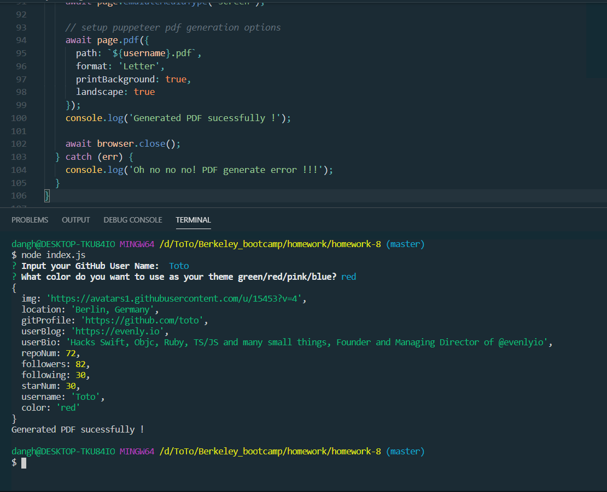
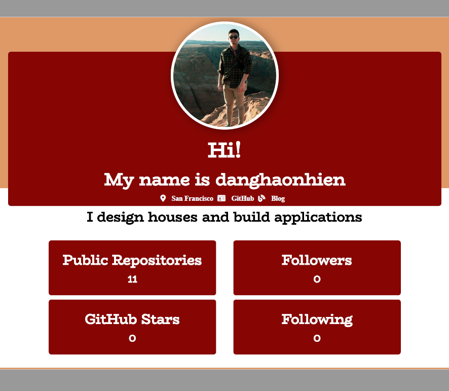

Developer-Profile-Generator

-Created a command-line application that dynamically generates a PDF profile from a GitHub username.
-Built a Developer Profile Generator using the GitHub API

NPMs
-puppeteer
-inquirer
-axios
-fs
-util

Guidelines:
Proceeds as follows:
The user will be prompted for a GitHub Username and favorite color, which will be used as the background color for cards.

The PDF will be populated with the following:

Profile image
User name
Links to the following:
User location via Google Maps
User GitHub profile
User blog
User bio
Number of public repositories
Number of followers
Number of GitHub stars
Number of users following

